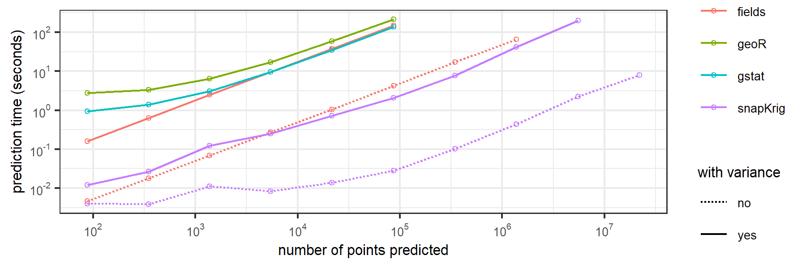
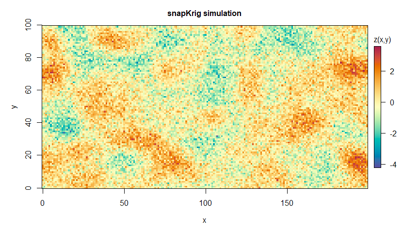
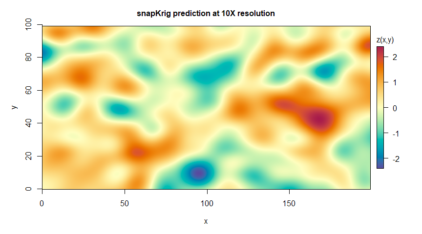

<!-- README.md is generated from README.Rmd. Please edit that file -->
<!-- #' # -->
<!-- #' TODO: -->
<!-- #' sk_plot_semi needs an explanation for getting vg -->
<!-- #' sk.plot refers to graphics::... when it should be grDevices -->

# snapKrig

An R package for fast spatial analysis and kriging on grids

<!-- badges: start -->

[](https://CRAN.R-project.org/package=snapKrig)
[](https://lifecycle.r-lib.org/articles/stages.html#stable)
[](https://cran.r-project.org/package=snapKrig)

<!-- badges: end -->

snapKrig uses a computationally lean implementation of a 2-dimensional
spatial correlation model for gridded (raster) data. By restricting to
models with separable Kronecker covariance, the package can speed
computations on certain likelihood and kriging problems by orders of
magnitude compared to alternatives like
[gstat](https://cran.r-project.org/package=gstat),
[fields](https://cran.r-project.org/package=fields),
[geoR](https://cran.r-project.org/package=geoR),
[spatial](https://cran.r-project.org/package=spatial), and
[LatticeKrig](https://cran.r-project.org/package=LatticeKrig).

Here are some benchmarking results (*circa* 2023-2024) for computation
time to downscale a 32 x 43 raster onto grids of increasing size by
ordinary kriging.



code and instructions to reproduce these results can be found
[here](https://github.com/deankoch/snapKrig/tree/master/rjarticle/data)

## Literature

I developed snapKrig to interpolate weather data, but the underlying
computational tricks are useful more broadly in statistics. Here are
some links to my research on product kernels with co-authors Mark Lewis
and Subhash Lele:

- fitting a covariance model ([Journal of the Royal Society Interface -
  2020](https://doi.org/10.1098/rsif.2020.0434))

- estimating the direction of anisotropy ([Environmental Ecological
  Statistics - 2020](https://doi.org/10.1007/s10651-020-00456-2), [U of
  A preprint](https://doi.org/10.7939/r3-g6qb-bq70))

- calculating dispersal kernel convolutions ([Bulletin of Mathematical
  Biology - 2021](https://doi.org/10.1007/s11538-021-00899-z))

## Installation

snapKrig is on [CRAN](https://cran.r-project.org/package=snapKrig).
Install it with

``` r
install.packages('snapKrig')
```

or use `devtools` to install the latest development version

``` r
devtools::install_github('deankoch/snapKrig')
```

Check out the [introduction
vignette](https://CRAN.R-project.org/package=snapKrig/vignettes/snapKrig_introduction.html)
for a worked example with the Meuse soils data, or try the code below to
get started right away. Other code examples be found
[here](https://github.com/deankoch/snapKrig/tree/master/examples).

## Example

To get started define an empty grid

``` r
library(snapKrig)

# simulate data on a rectangular grid
g_empty = sk(c(100, 200))
g_empty
#> 100 x 200 empty
```

Generate some random auto-correlated data for this grid

``` r
# set a random seed
set.seed(1234567)

# simulate data on a square grid
pars = sk_pars(g_empty)
g_sim = sk_sim(g_empty, pars)

# plot
plot(g_sim, main='snapKrig simulation')
```



``` r
g_sim
#> 100 x 200 complete
```

Downscale and filter noise by simple kriging

``` r
# downscale and predict, timing computations
t_start = Sys.time()
g_down = sk_rescale(g_sim, down=10)
g_pred = sk_cmean(g_down, pars, X=0)
#> 100 x 200 complete sub-grid detected

# print time elapsed in computation
t_end = Sys.time()
t_end - t_start
#> Time difference of 0.5637186 secs
```

``` r
# plot grid
plot(g_pred, main='snapKrig prediction at 10X resolution')
```



``` r

# print summary
summary(g_pred)
#> complete sk grid
#> 1973081 points
#> range [-1.95, 2.26]
#> ..............................
#> dimensions : 991 x 1991
#> resolution : 0.1 x 0.1
#>     extent : [0, 99] x [0, 199]
```

# Technical Features

snapKrig’s computational efficiency makes it useful in situations where
interpolation or down-scaling would pose a problem due to long
computation times and/or high memory demands. Features include:

- anisotropic Gaussian processes on 2-dimensional regular grids for a
  choice of covariance kernels
- optimized computation of the likelihood function, generalized least
  squares, and kriging predictor/variance
- fast computations with missing data problems, and even faster in the
  complete data case
- automated maximum likelihood model fitting and support for sample
  semi-variograms
- user friendly helper functions for raster down-scaling and point
  interpolation

Grid data can be supplied as vector, matrix, or RasterLayer/SpatRaster.
snapKrig depends only on core packages that are included by default in R
(like `graphics` and `stats`), but we suggest using it combination with
`sf` and `terra`.

# History

My co-authors and I intended publish a more detailed tutorial and
benchmarking study in an R Journal paper ([see the draft
here](https://github.com/deankoch/snapKrig/tree/master/rjarticle)). This
plan was put on hiatus because I developed tendonitis and had to stop
coding/writing in my free time. I hope to pick up the project again at
some point in the future.

An earlier implementation of snapKrig was called
[pkern](https://github.com/deankoch/pkern). snapKrig is a redesigned
version that uses a more user-friendly S3 grid object class.

pkern was an R implementation of some methods I developed in [my
thesis](https://doi.org/10.7939/r3-91zn-v276) for speeding up
geostatistical computations involving large covariance matrices. The
central idea is to model spatial dependence using a separable
2-dimensional covariance kernel, defined as the product of two
(1-dimensional) univariate covariance kernels. This introduces special
symmetries and structure in the covariance matrix, which are exploited
in this package for fast and memory-efficient computations.
