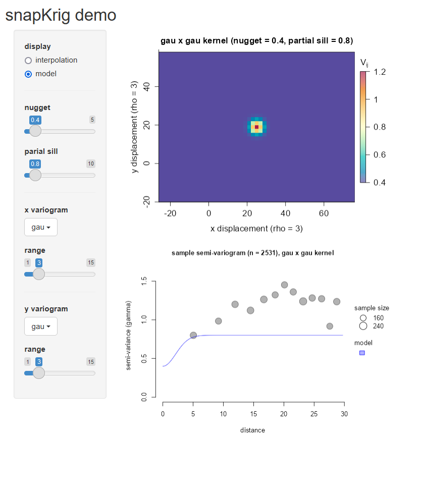
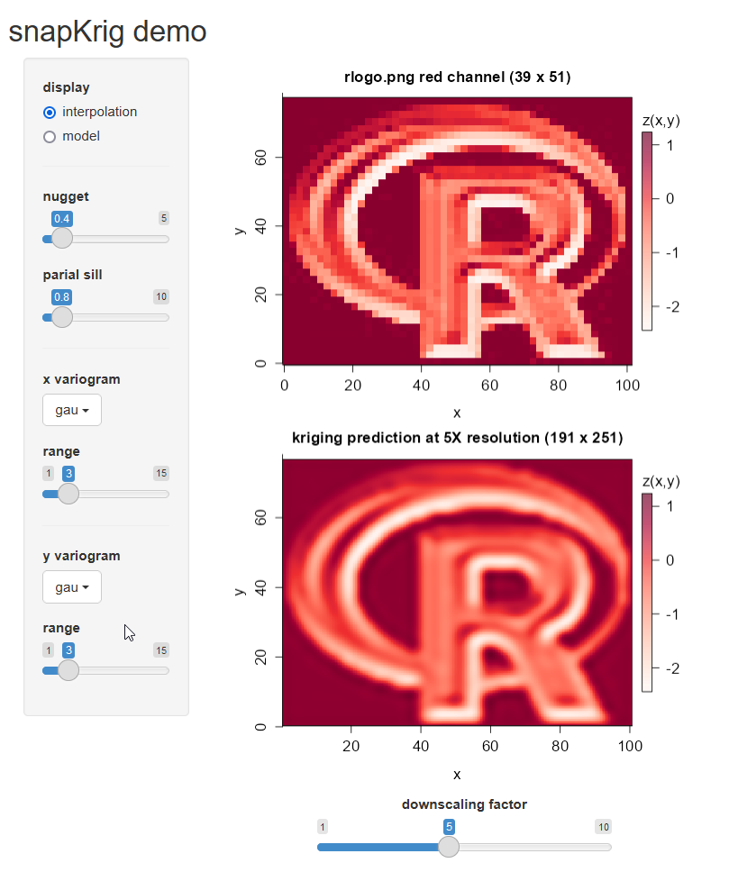

## Examples

This folder is for miscellaneous self-contained snapKrig code examples that won't work well as vignettes:

* [wolf_territory](https://github.com/deankoch/snapKrig/tree/master/examples/wolf_territory) is an experiment looking at bias introduced in territory estimation when using coarse resolution grids.

* [shiny_demo](https://github.com/deankoch/snapKrig/tree/master/examples/shiny_demo) lets users play with covariance parameter sliders to see their effect on interpolation. Simply run the script to launch the app

