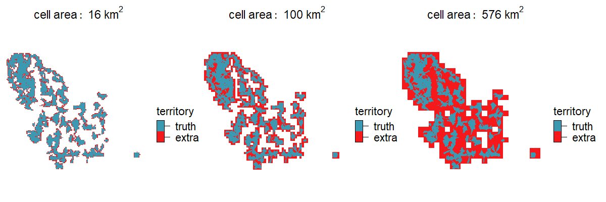
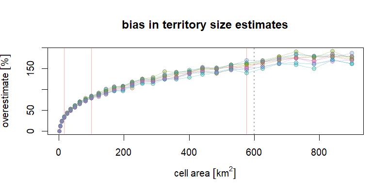

## Territory estimation experiment

**Dean Koch**, Feb 2023

This runs a simulation experiment using the NetLogo model from the paper "Economical Defense of Resources Structures Territorial Space Use in a Cooperative Carnivore" by S. Sells *et al*, published in [*Proceedings of the Royal Society B* in 2022](https://doi.org/10.1098/rspb.2021.2512). We run simulations from this model to get a set of artificial wolf territory maps. Then we estimate the area occupied by this territory by counting grid cells overlapping with territory, and measure the resulting bias. 

To repeat the workflow, first download the data supplement for the above paper at [this Dryad repository](https://doi.org/10.5061/dryad.mpg4f4r1r) and unzip to a local directory. This should produce a file "Model.zip" containing the NetLogo model configuration files.

There is no need to unzip "Model.zip" yourself (R will do this for you), but if you do, be warned that it contains an installer for NetLogo v6.1.1, a version that doesn't work with a required package `RNetLogo` at this time. You will need to install an earlier version, v6.0.4.

### Contents

The simulation experiment uses 4 Rscript files

* [0_netlogo_helpers.R](https://github.com/deankoch/snapKrig/blob/master/examples/wolf_territory/0_netlogo_helpers.R) : helper function definitions
* [1_run_netlogo.R](https://github.com/deankoch/snapKrig/blob/master/examples/wolf_territory/1_run_netlogo.R) : runs a NetLogo simulation, saves results to .tif
* [2_process_netlogo_results.R](https://github.com/deankoch/snapKrig/blob/master/examples/wolf_territory/2_process_netlogo_results.R) : runs analysis on all output from (2), saves results to .rds
* [3_display_netlogo_analysis.R](https://github.com/deankoch/snapKrig/blob/master/examples/wolf_territory/3_display_netlogo_analysis.R) : creates three .png plots using analysis results

### Notes

* NetLogo simulations are slow. Each repetition of "1_run_netlogo.R" takes about 2-3 hours
* NetLogo v6.0.4 is (currently) required for compatibility with the RNetLogo package
* NetLogo input/output is found in the "Model" subfolder of `proj_dir` after running a simulation

### Instructions

1) Install NetLogo v6.0.4 using the installers at [this link](https://ccl.northwestern.edu/netlogo/6.0.4/)

2) Download the Sells *et al* data supplement zip, and extract "Model.zip"

3) Open the R files numbered (1)-(3) and in each one change the path `proj_dir` to something appropriate for your computer (this is where model files and all results are stored). Check also that `supplement_zip` and `helper_path` point to the right place.

4) Run the script "1_run_netlogo.R" multiple times. A new output .tif file is written to `proj_dir` each time.

5) Run the script "2_process_netlogo_results.R" to run the analysis on all .tif files found in `proj_dir`

6) Run the script "3_display_netlogo_analysis.R" to summarize the analysis in three figures

To run this experiment on a different raster dataset, simply run scripts (2)-(3) (steps 5 and 6) with your own raster files and make the necessary adjustments to units and axis labels. The rasters should be .tif files with territory denoted by values greater than zero.

## Summary

We approximated the total area of territory by overlaying a coarse resolution grid and counting cells that contained *any* amount of territory. This is an overestimate, because when a coarse resolution cell partially overlaps with wolf territory, the non-overlapping areas within the cell are also (mistakenly) marked as occupied. The extra area introduces bias. Here are three examples:

  

These show, in blue, an example (simulated) wolf territory, and in red, the extra area introduced. As we coarsen the resolution (making cell area larger), the total amount of extra area increases dramatically, and so does the bias.

Here is what this bias looks like in terms of percent overestimation:

  

Points in this plot are the results from 10 simulated territory maps tested at 30 different resolutions.

